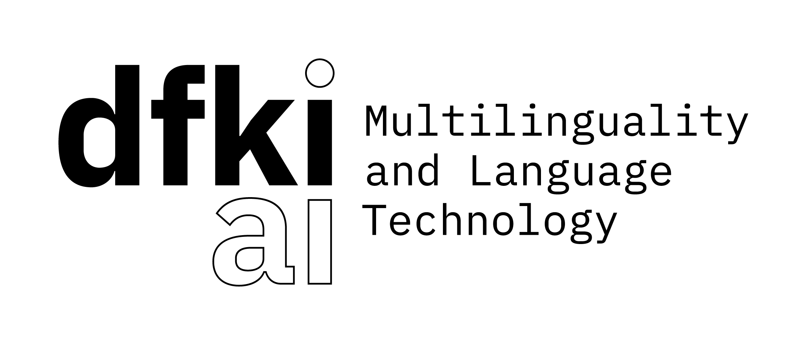
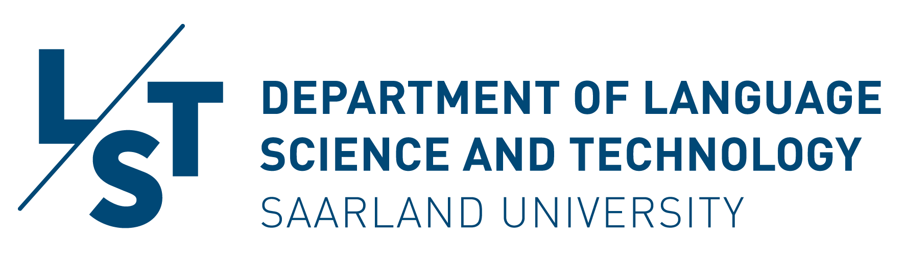
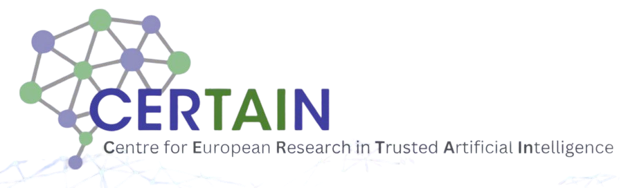

<h1 align="center">
  
</h1>

<p align="center">
    <!-- ArXiv Paper -->
    <a href="https://arxiv.org/abs/2409.18193">
        
    </a>
    <!-- Hugging Face -->
    <a href="https://huggingface.co/DFKI">
        
    </a>
    <!-- Python Version -->
      <a href="https://www.python.org/">
      
      </a>
    <!-- License -->
    <a href="https://github.com/d-gurgurov/GrEmLIn-Green-Embeddings-LRLs/blob/main/LICENSE">
        
    </a>
    <!-- Open Source -->
    <a href="https://github.com/d-gurgurov/GrEmLIn-Green-Embeddings-LRLs/">
        
    </a>
</p>


<h3 align="center">
    <a href="https://www.dfki.de/web/forschung/forschungsbereiche/sprachtechnologie-und-multilingualitaet">
        
    </a>
    <a href="https://www.uni-saarland.de/en/department/lst.html">
        
    </a>
    <a href="https://www.certain-trust.eu/">
        
    </a>
</h3>

<h3 align="center">
</h3>


## A Repository of Green Baseline Embeddings for 87 Low-Resource Languages Injected with Multilingual Graph Knowledge

### Project Overview
- This project provides open-source **"green" GloVe embeddings** for **87 mid- and low-resource languages** trained using **CC100**.
- The embeddings can be **augmented with graph knowledge from ConceptNet** to enhance their performance and semantic understanding.

### Embeddings Details
- **Available for 87 languages** described in the table below.
- Our **graph-enhanced embeddings** can be downloaded from the [ConceptNet embeddings on Hugging Face](https://huggingface.co/DGurgurov/conceptnet_embeddings).
- **Augmentation Method**: Use the algorithm provided in the repository ([merge_emb-s.py](https://github.com/d-gurgurov/GrEmLIn-Green-Embeddings-LRLs/blob/main/src/utils/merge_emb-s.py)) to merge the GloVe embeddings with ConceptNet graph embeddings.

## Why Static Embeddings in 2025?

- **Static embeddings outperform large models**: Despite the popularity of large language models (LLMs), **static embeddings** like GloVe still outperform models such as **GPT-4** and **Llama3** in many tasks, especially for low-resource languages.

- **Lower Environmental Impact**: 
   - **GloVe embeddings**: 19.05 kg of CO2 (equivalent to a few car drives).
   - **BERT embeddings**: 635 kg of CO2 (equivalent to a 1,600 km car trip)—**30 times more** than the emissions from GloVe embeddings.
   - **LLaMA-8B model**: 390,000 kg of CO2 (equivalent to the annual energy consumption of around 100 homes)—**20,473 times more** than that of GloVe embeddings.


---

<details>
  <summary><strong>Show/Hide Language Data Table</strong></summary>

  <table>
    <thead>
      <tr>
        <th>ISO</th>
        <th>Language Name</th>
        <th>Dataset Size</th>
        <th>Class</th>
        <th>ConceptNet Data</th>
      </tr>
    </thead>
    <tbody>
      <tr><td>ss</td><td>Swati</td><td>86K</td><td>1</td><td>✘</td></tr>
        <tr><td>sc</td><td>Sardinian</td><td>143K</td><td>1</td><td>✓</td></tr>
        <tr><td>yo</td><td>Yoruba</td><td>1.1M</td><td>2</td><td>✓</td></tr>
        <tr><td>gn</td><td>Guarani</td><td>1.5M</td><td>1</td><td>✓</td></tr>
        <tr><td>qu</td><td>Quechua</td><td>1.5M</td><td>1</td><td>✓</td></tr>
        <tr><td>ns</td><td>Northern Sotho</td><td>1.8M</td><td>1</td><td>✘</td></tr>
        <tr><td>li</td><td>Limburgish</td><td>2.2M</td><td>1</td><td>✓</td></tr>
        <tr><td>ln</td><td>Lingala</td><td>2.3M</td><td>1</td><td>✓</td></tr>
        <tr><td>wo</td><td>Wolof</td><td>3.6M</td><td>2</td><td>✓</td></tr>
        <tr><td>zu</td><td>Zulu</td><td>4.3M</td><td>2</td><td>✓</td></tr>
        <tr><td>rm</td><td>Romansh</td><td>4.8M</td><td>1</td><td>✓</td></tr>
        <tr><td>ig</td><td>Igbo</td><td>6.6M</td><td>1</td><td>✘</td></tr>
        <tr><td>lg</td><td>Ganda</td><td>7.3M</td><td>1</td><td>✘</td></tr>
        <tr><td>as</td><td>Assamese</td><td>7.6M</td><td>1</td><td>✘</td></tr>
        <tr><td>tn</td><td>Tswana</td><td>8.0M</td><td>2</td><td>✘</td></tr>
        <tr><td>ht</td><td>Haitian</td><td>9.1M</td><td>2</td><td>✓</td></tr>
        <tr><td>om</td><td>Oromo</td><td>11M</td><td>1</td><td>✘</td></tr>
        <tr><td>su</td><td>Sundanese</td><td>15M</td><td>1</td><td>✓</td></tr>
        <tr><td>bs</td><td>Bosnian</td><td>18M</td><td>3</td><td>✘</td></tr>
        <tr><td>br</td><td>Breton</td><td>21M</td><td>1</td><td>✓</td></tr>
        <tr><td>gd</td><td>Scottish Gaelic</td><td>22M</td><td>1</td><td>✓</td></tr>
        <tr><td>xh</td><td>Xhosa</td><td>25M</td><td>2</td><td>✓</td></tr>
        <tr><td>mg</td><td>Malagasy</td><td>29M</td><td>1</td><td>✓</td></tr>
        <tr><td>jv</td><td>Javanese</td><td>37M</td><td>1</td><td>✓</td></tr>
        <tr><td>fy</td><td>Frisian</td><td>38M</td><td>0</td><td>✓</td></tr>
        <tr><td>sa</td><td>Sanskrit</td><td>44M</td><td>2</td><td>✓</td></tr>
        <tr><td>my</td><td>Burmese</td><td>46M</td><td>1</td><td>✓</td></tr>
        <tr><td>ug</td><td>Uyghur</td><td>46M</td><td>1</td><td>✓</td></tr>
        <tr><td>yi</td><td>Yiddish</td><td>51M</td><td>1</td><td>✓</td></tr>
        <tr><td>or</td><td>Oriya</td><td>56M</td><td>1</td><td>✓</td></tr>
        <tr><td>ha</td><td>Hausa</td><td>61M</td><td>2</td><td>✓</td></tr>
        <tr><td>la</td><td>Lao</td><td>63M</td><td>2</td><td>✓</td></tr>
        <tr><td>sd</td><td>Sindhi</td><td>67M</td><td>1</td><td>✓</td></tr>
        <tr><td>ta_rom</td><td>Tamil Romanized</td><td>68M</td><td>3</td><td>✘</td></tr>
        <tr><td>so</td><td>Somali</td><td>78M</td><td>1</td><td>✓</td></tr>
        <tr><td>te_rom</td><td>Telugu Romanized</td><td>79M</td><td>1</td><td>✘</td></tr>
        <tr><td>ku</td><td>Kurdish</td><td>90M</td><td>0</td><td>✓</td></tr>
        <tr><td>pu</td><td>Punjabi</td><td>90M</td><td>2</td><td>✓</td></tr>
        <tr><td>ps</td><td>Pashto</td><td>107M</td><td>1</td><td>✓</td></tr>
        <tr><td>ga</td><td>Irish</td><td>108M</td><td>2</td><td>✓</td></tr>
        <tr><td>am</td><td>Amharic</td><td>133M</td><td>2</td><td>✓</td></tr>
        <tr><td>ur_rom</td><td>Urdu Romanized</td><td>141M</td><td>3</td><td>✘</td></tr>
        <tr><td>km</td><td>Khmer</td><td>153M</td><td>1</td><td>✓</td></tr>
        <tr><td>uz</td><td>Uzbek</td><td>155M</td><td>3</td><td>✓</td></tr>
        <tr><td>bn_rom</td><td>Bengali Romanized</td><td>164M</td><td>3</td><td>✘</td></tr>
        <tr><td>ky</td><td>Kyrgyz</td><td>173M</td><td>3</td><td>✓</td></tr>
        <tr><td>my_zaw</td><td>Burmese (Zawgyi)</td><td>178M</td><td>1</td><td>✘</td></tr>
        <tr><td>cy</td><td>Welsh</td><td>179M</td><td>1</td><td>✓</td></tr>
        <tr><td>gu</td><td>Gujarati</td><td>242M</td><td>1</td><td>✓</td></tr>
        <tr><td>eo</td><td>Esperanto</td><td>250M</td><td>1</td><td>✓</td></tr>
        <tr><td>af</td><td>Afrikaans</td><td>305M</td><td>3</td><td>✓</td></tr>
        <tr><td>sw</td><td>Swahili</td><td>332M</td><td>2</td><td>✓</td></tr>
        <tr><td>mr</td><td>Marathi</td><td>334M</td><td>2</td><td>✓</td></tr>
        <tr><td>kn</td><td>Kannada</td><td>360M</td><td>1</td><td>✓</td></tr>
        <tr><td>ne</td><td>Nepali</td><td>393M</td><td>1</td><td>✓</td></tr>
        <tr><td>mn</td><td>Mongolian</td><td>397M</td><td>1</td><td>✓</td></tr>
        <tr><td>si</td><td>Sinhala</td><td>452M</td><td>0</td><td>✓</td></tr>
        <tr><td>te</td><td>Telugu</td><td>536M</td><td>1</td><td>✓</td></tr>
        <tr><td>la</td><td>Latin</td><td>609M</td><td>3</td><td>✓</td></tr>
        <tr><td>be</td><td>Belarussian</td><td>692M</td><td>3</td><td>✓</td></tr>
        <tr><td>tl</td><td>Tagalog</td><td>701M</td><td>3</td><td>✘</td></tr>
        <tr><td>mk</td><td>Macedonian</td><td>706M</td><td>1</td><td>✓</td></tr>
        <tr><td>gl</td><td>Galician</td><td>708M</td><td>3</td><td>✓</td></tr>
        <tr><td>hy</td><td>Armenian</td><td>776M</td><td>1</td><td>✓</td></tr>
        <tr><td>is</td><td>Icelandic</td><td>779M</td><td>2</td><td>✓</td></tr>
        <tr><td>ml</td><td>Malayalam</td><td>831M</td><td>1</td><td>✓</td></tr>
        <tr><td>bn</td><td>Bengali</td><td>860M</td><td>3</td><td>✓</td></tr>
        <tr><td>ur</td><td>Urdu</td><td>884M</td><td>3</td><td>✓</td></tr>
        <tr><td>kk</td><td>Kazakh</td><td>889M</td><td>3</td><td>✓</td></tr>
        <tr><td>ka</td><td>Georgian</td><td>1.1G</td><td>3</td><td>✓</td></tr>
        <tr><td>az</td><td>Azerbaijani</td><td>1.3G</td><td>1</td><td>✓</td></tr>
        <tr><td>sq</td><td>Albanian</td><td>1.3G</td><td>1</td><td>✓</td></tr>
        <tr><td>ta</td><td>Tamil</td><td>1.3G</td><td>3</td><td>✓</td></tr>
        <tr><td>et</td><td>Estonian</td><td>1.7G</td><td>3</td><td>✓</td></tr>
        <tr><td>lv</td><td>Latvian</td><td>2.1G</td><td>3</td><td>✓</td></tr>
        <tr><td>ms</td><td>Malay</td><td>2.1G</td><td>3</td><td>✓</td></tr>
        <tr><td>sl</td><td>Slovenian</td><td>2.8G</td><td>3</td><td>✓</td></tr>
        <tr><td>lt</td><td>Lithuanian</td><td>3.4G</td><td>3</td><td>✓</td></tr>
        <tr><td>he</td><td>Hebrew</td><td>6.1G</td><td>3</td><td>✓</td></tr>
        <tr><td>sk</td><td>Slovak</td><td>6.1G</td><td>3</td><td>✓</td></tr>
        <tr><td>el</td><td>Greek</td><td>7.4G</td><td>3</td><td>✓</td></tr>
        <tr><td>th</td><td>Thai</td><td>8.7G</td><td>3</td><td>✓</td></tr>
        <tr><td>bg</td><td>Bulgarian</td><td>9.3G</td><td>3</td><td>✓</td></tr>
        <tr><td>da</td><td>Danish</td><td>12G</td><td>3</td><td>✓</td></tr>
        <tr><td>uk</td><td>Ukrainian</td><td>14G</td><td>3</td><td>✓</td></tr>
        <tr><td>ro</td><td>Romanian</td><td>16G</td><td>3</td><td>✓</td></tr>
        <tr><td>id</td><td>Indonesian</td><td>36G</td><td>3</td><td>✘</td></tr>
    </tbody>
  </table>

</details>


## ConceptNet Data Details

### Data Extraction Process
1. **Source**: Data is extracted from the **ConceptNet database** (available [here](https://github.com/commonsense/conceptnet5/wiki/Downloads)).
2. **Extraction Steps**:
   - Clean and analyze the data from the official **ConceptNet dump** ([ConceptNet assertions dump](https://s3.amazonaws.com/conceptnet/downloads/2019/edges/conceptnet-assertions-5.7.0.csv.gz)).
   - The extracted dataset is in **JSON format** representing a dictionary with language codes and start and end edges for each language.
3. **Start Edges**: Represent unique words in a target language.
4. **End Edges**: Represent words related to the start edges through various types of relationships (relationship types and sources are not included in the extraction).
5. **Data Availability**: 
   - The dataset is available on [Hugging Face](https://huggingface.co/datasets/DGurgurov/conceptnet_all).
   - A detailed description of the amount of data extracted for each language is also provided.

---


## Usage

- If you use our **embedding enhancement method** or **pre-trained embeddings**, please consider citing our preview paper (the full paper is to be published in the **Findings of NAACL 2025**):

```bibtex
@misc{gurgurov2024gremlinrepositorygreenbaseline,
      title={GrEmLIn: A Repository of Green Baseline Embeddings for 87 Low-Resource Languages Injected with Multilingual Graph Knowledge}, 
      author={Daniil Gurgurov and Rishu Kumar and Simon Ostermann},
      year={2024},
      eprint={2409.18193},
      archivePrefix={arXiv},
      primaryClass={cs.CL},
      url={https://arxiv.org/abs/2409.18193}, 
}
```

## License

This project is licensed under the Apache License - see the [LICENSE] file for details.
