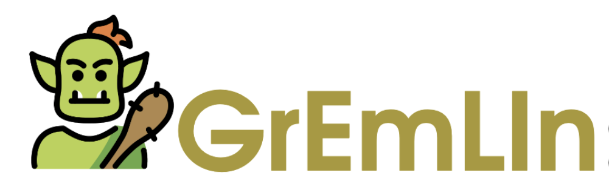

<h1 align="center">
  
</h1>

<p align="center">
    <!-- ArXiv Paper -->
    <a href="https://arxiv.org/abs/2409.18193">
        
    </a>
    <!-- Hugging Face -->
    <a href="https://huggingface.co/DFKI">
        
    </a>
    <!-- Python Version -->
      <a href="https://www.python.org/">
      
      </a>
    <!-- License -->
    <a href="https://github.com/d-gurgurov/GrEmLIn-Green-Embeddings-LRLs/blob/main/LICENSE">
        
    </a>
    <!-- Open Source -->
    <a href="https://github.com/d-gurgurov/GrEmLIn-Green-Embeddings-LRLs/">
        
    </a>
</p>


<h3 align="center">
    <a href="https://www.dfki.de/web/forschung/forschungsbereiche/sprachtechnologie-und-multilingualitaet">
        
    </a>
    <a href="https://www.uni-saarland.de/en/department/lst.html">
        
    </a>
    <a href="https://www.certain-trust.eu/">
        
    </a>
</h3>

<h3 align="center">
</h3>


## A Repository of Green Baseline Embeddings for 87 Low-Resource Languages Injected with Multilingual Graph Knowledge

### Project Overview
- This project provides open-source **"green" GloVe embeddings** for **87 mid- and low-resource languages** trained using **CC100**.
- The embeddings can be **augmented with graph knowledge from ConceptNet** to enhance their performance and semantic understanding.

### Embeddings Details
- **Available for 87 languages** described in the table below.
- Our **graph-enhanced embeddings** can be downloaded from the [ConceptNet embeddings on Hugging Face](https://huggingface.co/DGurgurov/conceptnet_embeddings).
- **Augmentation Method**: Use the algorithm provided in the repository ([merge_emb-s.py](https://github.com/d-gurgurov/GrEmLIn-Green-Embeddings-LRLs/blob/main/src/utils/merge_emb-s.py)) to merge the GloVe embeddings with ConceptNet graph embeddings.

## Why Static Embeddings in 2025?

- **Static embeddings outperform large models**: Despite the popularity of large language models (LLMs), **static embeddings** like GloVe still outperform models such as **GPT-4** and **Llama3** in many tasks, especially for low-resource languages.

- **Lower Environmental Impact**: 
   - **GloVe embeddings**: 19.05 kg of CO2 (equivalent to a few car drives).
   - **BERT embeddings**: 635 kg of CO2 (equivalent to a 1,600 km car trip)—**30 times more** than the emissions from GloVe embeddings.
   - **LLaMA-8B model**: 390,000 kg of CO2 (equivalent to the annual energy consumption of around 100 homes)—**20,473 times more** than that of GloVe embeddings.


---

<details>
  <summary><strong>Show/Hide Language Data Table</strong></summary>

  <table>
    <thead>
      <tr>
        <th>ISO</th>
        <th>Language Name</th>
        <th>Dataset Size</th>
        <th>Class</th>
        <th>ConceptNet Data</th>
      </tr>
    </thead>
    <tbody>
      <tr><td><a href="https://huggingface.co/DFKI/glove-ss-cc100">ss</a></td><td>Swati</td><td>86K</td><td>1</td><td>✘</td></tr>
        <tr><td><a href="https://huggingface.co/DFKI/glove-sc-cc100">sc</a></td><td>Sardinian</td><td>143K</td><td>1</td><td>✓</td></tr>
        <tr><td><a href="https://huggingface.co/DFKI/glove-yo-cc100">yo</a></td><td>Yoruba</td><td>1.1M</td><td>2</td><td>✓</td></tr>
        <tr><td><a href="https://huggingface.co/DFKI/glove-gn-cc100">gn</a></td><td>Guarani</td><td>1.5M</td><td>1</td><td>✓</td></tr>
        <tr><td><a href="https://huggingface.co/DFKI/glove-qu-cc100">qu</a></td><td>Quechua</td><td>1.5M</td><td>1</td><td>✓</td></tr>
        <tr><td><a href="https://huggingface.co/DFKI/glove-ns-cc100">ns</a></td><td>Northern Sotho</td><td>1.8M</td><td>1</td><td>✘</td></tr>
        <tr><td><a href="https://huggingface.co/DFKI/glove-li-cc100">li</a></td><td>Limburgish</td><td>2.2M</td><td>1</td><td>✓</td></tr>
        <tr><td><a href="https://huggingface.co/DFKI/glove-ln-cc100">ln</a></td><td>Lingala</td><td>2.3M</td><td>1</td><td>✓</td></tr>
        <tr><td><a href="https://huggingface.co/DFKI/glove-wo-cc100">wo</a></td><td>Wolof</td><td>3.6M</td><td>2</td><td>✓</td></tr>
        <tr><td><a href="https://huggingface.co/DFKI/glove-zu-cc100">zu</a></td><td>Zulu</td><td>4.3M</td><td>2</td><td>✓</td></tr>
        <tr><td><a href="https://huggingface.co/DFKI/glove-rm-cc100">rm</a></td><td>Romansh</td><td>4.8M</td><td>1</td><td>✓</td></tr>
        <tr><td><a href="https://huggingface.co/DFKI/glove-ig-cc100">ig</a></td><td>Igbo</td><td>6.6M</td><td>1</td><td>✘</td></tr>
        <tr><td><a href="https://huggingface.co/DFKI/glove-lg-cc100">lg</a></td><td>Ganda</td><td>7.3M</td><td>1</td><td>✘</td></tr>
        <tr><td><a href="https://huggingface.co/DFKI/glove-as-cc100">as</a></td><td>Assamese</td><td>7.6M</td><td>1</td><td>✘</td></tr>
        <tr><td><a href="https://huggingface.co/DFKI/glove-tn-cc100">tn</a></td><td>Tswana</td><td>8.0M</td><td>2</td><td>✘</td></tr>
        <tr><td><a href="https://huggingface.co/DFKI/glove-ht-cc100">ht</a></td><td>Haitian</td><td>9.1M</td><td>2</td><td>✓</td></tr>
        <tr><td><a href="https://huggingface.co/DFKI/glove-om-cc100">om</a></td><td>Oromo</td><td>11M</td><td>1</td><td>✘</td></tr>
        <tr><td><a href="https://huggingface.co/DFKI/glove-su-cc100">su</a></td><td>Sundanese</td><td>15M</td><td>1</td><td>✓</td></tr>
        <tr><td><a href="https://huggingface.co/DFKI/glove-bs-cc100">bs</a></td><td>Bosnian</td><td>18M</td><td>3</td><td>✘</td></tr>
        <tr><td><a href="https://huggingface.co/DFKI/glove-br-cc100">br</a></td><td>Breton</td><td>21M</td><td>1</td><td>✓</td></tr>
        <tr><td><a href="https://huggingface.co/DFKI/glove-gd-cc100">gd</a></td><td>Scottish Gaelic</td><td>22M</td><td>1</td><td>✓</td></tr>
        <tr><td><a href="https://huggingface.co/DFKI/glove-xh-cc100">xh</a></td><td>Xhosa</td><td>25M</td><td>2</td><td>✓</td></tr>
        <tr><td><a href="https://huggingface.co/DFKI/glove-mg-cc100">mg</a></td><td>Malagasy</td><td>29M</td><td>1</td><td>✓</td></tr>
        <tr><td><a href="https://huggingface.co/DFKI/glove-jv-cc100">jv</a></td><td>Javanese</td><td>37M</td><td>1</td><td>✓</td></tr>
        <tr><td><a href="https://huggingface.co/DFKI/glove-fy-cc100">fy</a></td><td>Frisian</td><td>38M</td><td>0</td><td>✓</td></tr>
        <tr><td><a href="https://huggingface.co/DFKI/glove-sa-cc100">sa</a></td><td>Sanskrit</td><td>44M</td><td>2</td><td>✓</td></tr>
        <tr><td><a href="https://huggingface.co/DFKI/glove-my-cc100">my</a></td><td>Burmese</td><td>46M</td><td>1</td><td>✓</td></tr>
        <tr><td><a href="https://huggingface.co/DFKI/glove-ug-cc100">ug</a></td><td>Uyghur</td><td>46M</td><td>1</td><td>✓</td></tr>
        <tr><td><a href="https://huggingface.co/DFKI/glove-yi-cc100">yi</a></td><td>Yiddish</td><td>51M</td><td>1</td><td>✓</td></tr>
        <tr><td><a href="https://huggingface.co/DFKI/glove-or-cc100">or</a></td><td>Oriya</td><td>56M</td><td>1</td><td>✓</td></tr>
        <tr><td><a href="https://huggingface.co/DFKI/glove-ha-cc100">ha</a></td><td>Hausa</td><td>61M</td><td>2</td><td>✓</td></tr>
        <tr><td><a href="https://huggingface.co/DFKI/glove-la-cc100">la</a></td><td>Lao</td><td>63M</td><td>2</td><td>✓</td></tr>
        <tr><td><a href="https://huggingface.co/DFKI/glove-sd-cc100">sd</a></td><td>Sindhi</td><td>67M</td><td>1</td><td>✓</td></tr>
        <tr><td><a href="https://huggingface.co/DFKI/glove-ta_rom-cc100">ta_rom</a></td><td>Tamil Romanized</td><td>68M</td><td>3</td><td>✘</td></tr>
        <tr><td><a href="https://huggingface.co/DFKI/glove-so-cc100">so</a></td><td>Somali</td><td>78M</td><td>1</td><td>✓</td></tr>
        <tr><td><a href="https://huggingface.co/DFKI/glove-te_rom-cc100">te_rom</a></td><td>Telugu Romanized</td><td>79M</td><td>1</td><td>✘</td></tr>
        <tr><td><a href="https://huggingface.co/DFKI/glove-ku-cc100">ku</a></td><td>Kurdish</td><td>90M</td><td>0</td><td>✓</td></tr>
        <tr><td><a href="https://huggingface.co/DFKI/glove-pu-cc100">pu</a></td><td>Punjabi</td><td>90M</td><td>2</td><td>✓</td></tr>
        <tr><td><a href="https://huggingface.co/DFKI/glove-ps-cc100">ps</a></td><td>Pashto</td><td>107M</td><td>1</td><td>✓</td></tr>
        <tr><td><a href="https://huggingface.co/DFKI/glove-ga-cc100">ga</a></td><td>Irish</td><td>108M</td><td>2</td><td>✓</td></tr>
        <tr><td><a href="https://huggingface.co/DFKI/glove-am-cc100">am</a></td><td>Amharic</td><td>133M</td><td>2</td><td>✓</td></tr>
        <tr><td><a href="https://huggingface.co/DFKI/glove-ur_rom-cc100">ur_rom</a></td><td>Urdu Romanized</td><td>141M</td><td>3</td><td>✘</td></tr>
        <tr><td><a href="https://huggingface.co/DFKI/glove-km-cc100">km</a></td><td>Khmer</td><td>153M</td><td>1</td><td>✓</td></tr>
        <tr><td><a href="https://huggingface.co/DFKI/glove-uz-cc100">uz</a></td><td>Uzbek</td><td>155M</td><td>3</td><td>✓</td></tr>
        <tr><td><a href="https://huggingface.co/DFKI/glove-bn_rom-cc100">bn_rom</a></td><td>Bengali Romanized</td><td>164M</td><td>3</td><td>✘</td></tr>
        <tr><td><a href="https://huggingface.co/DFKI/glove-ky-cc100">ky</a></td><td>Kyrgyz</td><td>173M</td><td>3</td><td>✓</td></tr>
        <tr><td><a href="https://huggingface.co/DFKI/glove-my_zaw-cc100">my_zaw</a></td><td>Burmese (Zawgyi)</td><td>178M</td><td>1</td><td>✘</td></tr>
        <tr><td><a href="https://huggingface.co/DFKI/glove-cy-cc100">cy</a></td><td>Welsh</td><td>179M</td><td>1</td><td>✓</td></tr>
        <tr><td><a href="https://huggingface.co/DFKI/glove-gu-cc100">gu</a></td><td>Gujarati</td><td>242M</td><td>1</td><td>✓</td></tr>
        <tr><td><a href="https://huggingface.co/DFKI/glove-eo-cc100">eo</a></td><td>Esperanto</td><td>250M</td><td>1</td><td>✓</td></tr>
        <tr><td><a href="https://huggingface.co/DFKI/glove-af-cc100">af</a></td><td>Afrikaans</td><td>305M</td><td>3</td><td>✓</td></tr>
        <tr><td><a href="https://huggingface.co/DFKI/glove-sw-cc100">sw</a></td><td>Swahili</td><td>332M</td><td>2</td><td>✓</td></tr>
        <tr><td><a href="https://huggingface.co/DFKI/glove-mr-cc100">mr</a></td><td>Marathi</td><td>334M</td><td>2</td><td>✓</td></tr>
        <tr><td><a href="https://huggingface.co/DFKI/glove-kn-cc100">kn</a></td><td>Kannada</td><td>360M</td><td>1</td><td>✓</td></tr>
        <tr><td><a href="https://huggingface.co/DFKI/glove-ne-cc100">ne</a></td><td>Nepali</td><td>393M</td><td>1</td><td>✓</td></tr>
        <tr><td><a href="https://huggingface.co/DFKI/glove-mn-cc100">mn</a></td><td>Mongolian</td><td>397M</td><td>1</td><td>✓</td></tr>
        <tr><td><a href="https://huggingface.co/DFKI/glove-si-cc100">si</a></td><td>Sinhala</td><td>452M</td><td>0</td><td>✓</td></tr>
        <tr><td><a href="https://huggingface.co/DFKI/glove-te-cc100">te</a></td><td>Telugu</td><td>536M</td><td>1</td><td>✓</td></tr>
        <tr><td><a href="https://huggingface.co/DFKI/glove-la-cc100">la</a></td><td>Latin</td><td>609M</td><td>3</td><td>✓</td></tr>
        <tr><td><a href="https://huggingface.co/DFKI/glove-be-cc100">be</a></td><td>Belarussian</td><td>692M</td><td>3</td><td>✓</td></tr>
        <tr><td><a href="https://huggingface.co/DFKI/glove-tl-cc100">tl</a></td><td>Tagalog</td><td>701M</td><td>3</td><td>✘</td></tr>
        <tr><td><a href="https://huggingface.co/DFKI/glove-mk-cc100">mk</a></td><td>Macedonian</td><td>706M</td><td>1</td><td>✓</td></tr>
        <tr><td><a href="https://huggingface.co/DFKI/glove-gl-cc100">gl</a></td><td>Galician</td><td>708M</td><td>3</td><td>✓</td></tr>
        <tr><td><a href="https://huggingface.co/DFKI/glove-hy-cc100">hy</a></td><td>Armenian</td><td>776M</td><td>1</td><td>✓</td></tr>
        <tr><td><a href="https://huggingface.co/DFKI/glove-is-cc100">is</a></td><td>Icelandic</td><td>779M</td><td>2</td><td>✓</td></tr>
        <tr><td><a href="https://huggingface.co/DFKI/glove-ml-cc100">ml</a></td><td>Malayalam</td><td>831M</td><td>1</td><td>✓</td></tr>
        <tr><td><a href="https://huggingface.co/DFKI/glove-bn-cc100">bn</a></td><td>Bengali</td><td>860M</td><td>3</td><td>✓</td></tr>
        <tr><td><a href="https://huggingface.co/DFKI/glove-ur-cc100">ur</a></td><td>Urdu</td><td>884M</td><td>3</td><td>✓</td></tr>
        <tr><td><a href="https://huggingface.co/DFKI/glove-kk-cc100">kk</a></td><td>Kazakh</td><td>889M</td><td>3</td><td>✓</td></tr>
        <tr><td><a href="https://huggingface.co/DFKI/glove-ka-cc100">ka</a></td><td>Georgian</td><td>1.1G</td><td>3</td><td>✓</td></tr>
        <tr><td><a href="https://huggingface.co/DFKI/glove-az-cc100">az</a></td><td>Azerbaijani</td><td>1.3G</td><td>1</td><td>✓</td></tr>
        <tr><td><a href="https://huggingface.co/DFKI/glove-sq-cc100">sq</a></td><td>Albanian</td><td>1.3G</td><td>1</td><td>✓</td></tr>
        <tr><td><a href="https://huggingface.co/DFKI/glove-ta-cc100">ta</a></td><td>Tamil</td><td>1.3G</td><td>3</td><td>✓</td></tr>
        <tr><td><a href="https://huggingface.co/DFKI/glove-et-cc100">et</a></td><td>Estonian</td><td>1.7G</td><td>3</td><td>✓</td></tr>
        <tr><td><a href="https://huggingface.co/DFKI/glove-lv-cc100">lv</a></td><td>Latvian</td><td>2.1G</td><td>3</td><td>✓</td></tr>
        <tr><td><a href="https://huggingface.co/DFKI/glove-ms-cc100">ms</a></td><td>Malay</td><td>2.1G</td><td>3</td><td>✓</td></tr>
        <tr><td><a href="https://huggingface.co/DFKI/glove-sl-cc100">sl</a></td><td>Slovenian</td><td>2.8G</td><td>3</td><td>✓</td></tr>
        <tr><td><a href="https://huggingface.co/DFKI/glove-lt-cc100">lt</a></td><td>Lithuanian</td><td>3.4G</td><td>3</td><td>✓</td></tr>
        <tr><td><a href="https://huggingface.co/DFKI/glove-he-cc100">he</a></td><td>Hebrew</td><td>6.1G</td><td>3</td><td>✓</td></tr>
        <tr><td><a href="https://huggingface.co/DFKI/glove-sk-cc100">sk</a></td><td>Slovak</td><td>6.1G</td><td>3</td><td>✓</td></tr>
        <tr><td><a href="https://huggingface.co/DFKI/glove-el-cc100">el</a></td><td>Greek</td><td>7.4G</td><td>3</td><td>✓</td></tr>
        <tr><td><a href="https://huggingface.co/DFKI/glove-th-cc100">th</a></td><td>Thai</td><td>8.7G</td><td>3</td><td>✓</td></tr>
        <tr><td><a href="https://huggingface.co/DFKI/glove-bg-cc100">bg</a></td><td>Bulgarian</td><td>9.3G</td><td>3</td><td>✓</td></tr>
        <tr><td><a href="https://huggingface.co/DFKI/glove-da-cc100">da</a></td><td>Danish</td><td>12G</td><td>3</td><td>✓</td></tr>
        <tr><td><a href="https://huggingface.co/DFKI/glove-uk-cc100">uk</a></td><td>Ukrainian</td><td>14G</td><td>3</td><td>✓</td></tr>
        <tr><td><a href="https://huggingface.co/DFKI/glove-ro-cc100">ro</a></td><td>Romanian</td><td>16G</td><td>3</td><td>✓</td></tr>
        <tr><td><a href="https://huggingface.co/DFKI/glove-id-cc100">id</a></td><td>Indonesian</td><td>36G</td><td>3</td><td>✘</
    </tbody>
  </table>

</details>


## ConceptNet Data Details

### Data Extraction Process
1. **Source**: Data is extracted from the **ConceptNet database** (available [here](https://github.com/commonsense/conceptnet5/wiki/Downloads)).
2. **Extraction Steps**:
   - Clean and analyze the data from the official **ConceptNet dump** ([ConceptNet assertions dump](https://s3.amazonaws.com/conceptnet/downloads/2019/edges/conceptnet-assertions-5.7.0.csv.gz)).
   - The extracted dataset is in **JSON format** representing a dictionary with language codes and start and end edges for each language.
3. **Start Edges**: Represent unique words in a target language.
4. **End Edges**: Represent words related to the start edges through various types of relationships (relationship types and sources are not included in the extraction).
5. **Data Availability**: 
   - The dataset is available on [Hugging Face](https://huggingface.co/datasets/DGurgurov/conceptnet_all).
   - A detailed description of the amount of data extracted for each language is also provided.

---


## Usage

- If you use our **embedding enhancement method** or **pre-trained embeddings**, please consider citing our preview paper (the full paper is to be published in the **Findings of NAACL 2025**):

```bibtex
@misc{gurgurov2024gremlinrepositorygreenbaseline,
      title={GrEmLIn: A Repository of Green Baseline Embeddings for 87 Low-Resource Languages Injected with Multilingual Graph Knowledge}, 
      author={Daniil Gurgurov and Rishu Kumar and Simon Ostermann},
      year={2024},
      eprint={2409.18193},
      archivePrefix={arXiv},
      primaryClass={cs.CL},
      url={https://arxiv.org/abs/2409.18193}, 
}
```

## License

This project is licensed under the Apache License - see the [LICENSE] file for details.
